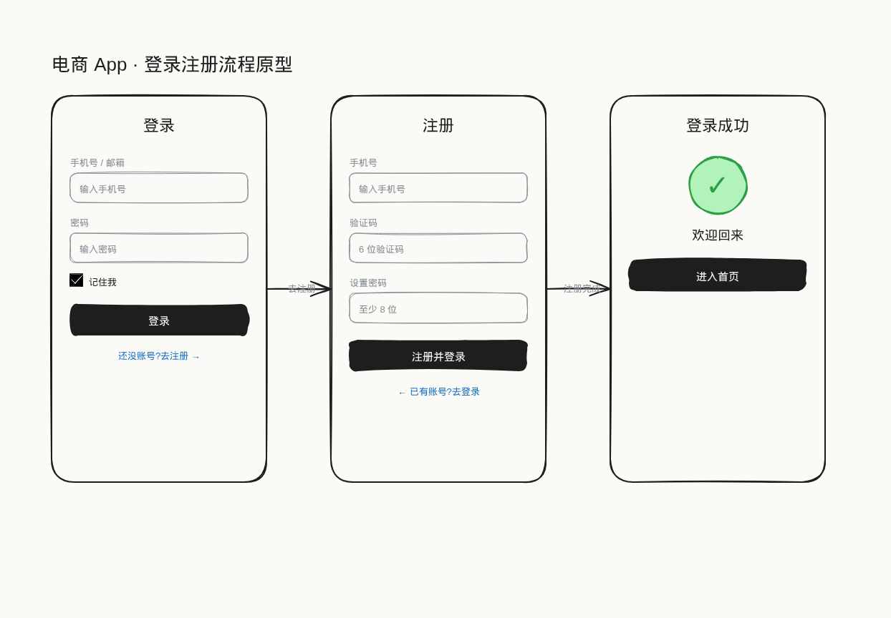
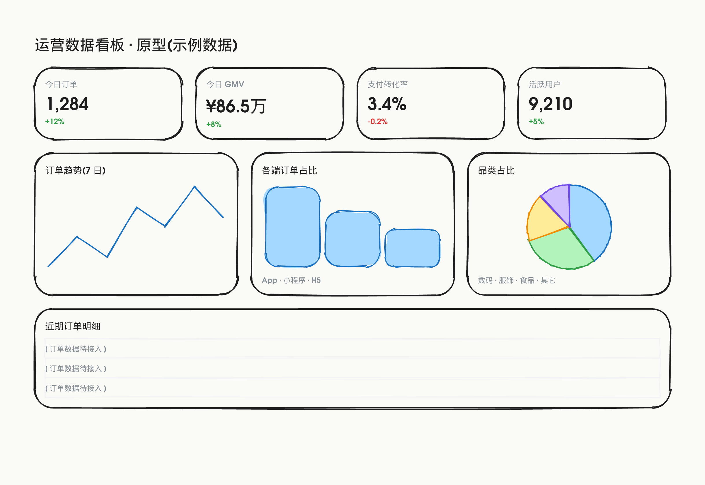
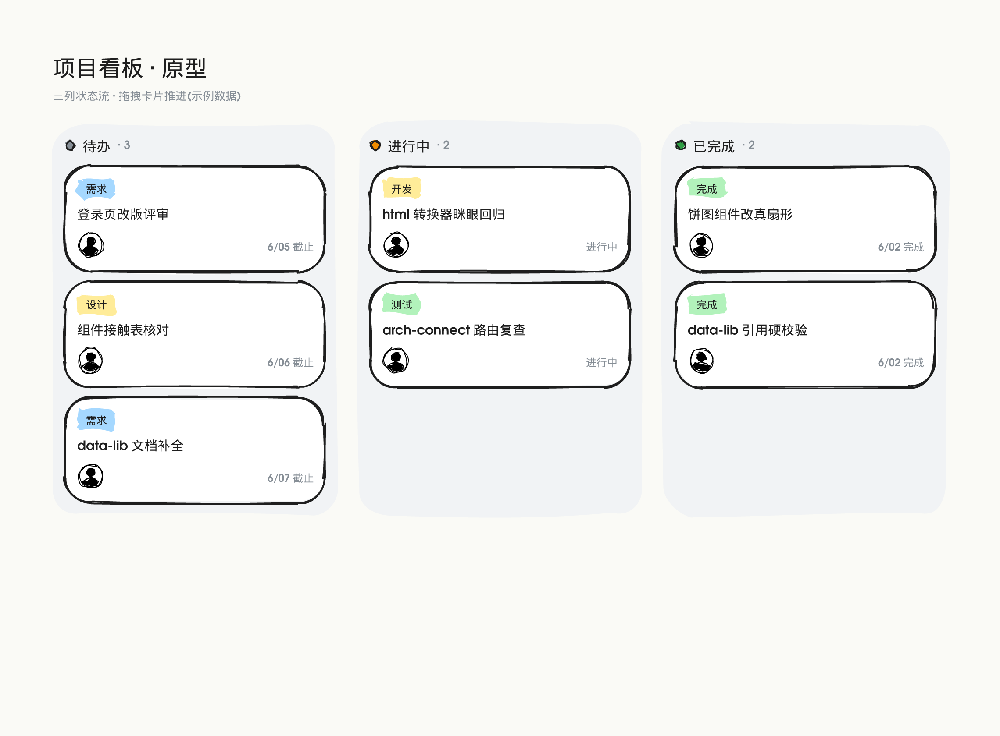

# Excali-Design

> *"一句话,一张能讲清楚的软件架构图 / 设计图 / 原型图。"*

用 **Excalidraw 手绘风**做**静态**的**软件架构图 / 设计图 / 产品原型图 / 信息流程图**的 agent-agnostic skill。产出全部是静态图(`.excalidraw` / PNG / SVG)——不做动画、视频、音频。

> 🙏 **本 skill 重度参考 [`huashu-design`](../huashu-design)(花叔 Design)设计。**
> SKILL.md 主干 + references 路由 + scripts 工具链,以及「反 AI slop / Junior Designer / 资产优先 / 事实验证」四大哲学,都直接继承自 huashu-design,只是把媒介从 HTML 换成了 Excalidraw 元素、聚焦静态图。没有 huashu-design 就没有这个 skill,在此致谢。

## 安装

**方式 A · `npx skills`(推荐,一键装到所有 agent)** —— 用 [vercel-labs/skills](https://github.com/vercel-labs/skills) CLI,GitHub 当注册表,自动探测你的 agent(opencode / Claude Code / Cursor / Codex 等):

```bash
npx skills add OhBonsai/excali-design -g          # 全局安装(~/.config/<agent>/skills 等)
npx skills add OhBonsai/excali-design             # 仅当前项目(./<agent>/skills/)
npx skills add OhBonsai/excali-design -a opencode -y   # 只装 opencode,非交互
```

**方式 B · 手动** —— 从 [Releases](../../releases) 下载 zip 解压到 agent 的 skills 目录,或直接 clone 本仓库到 agent 能读到的地方。

> 拉的是仓库**默认分支**(`master`,精简版)。

## 如何使用

**最省事 = 对着你的 AI agent 说一句话。** 这是一个 markdown-based 的 agent-agnostic skill(Claude Code / Cursor / Codex / Cowork 等都能用),装好(或把目录放进 agent 能读到的地方)后直接说:

```
安装并使用 excali-design 这个技能,帮我画一张订单服务的架构图
```

或:

```
用 excali-design,把我这个 React 项目的组件结构画成架构图
读 excali-design 技能,帮我画一套登录注册流程的产品原型
读一下我这个仓库,画出它的微服务调用关系图
```

agent 会自己读 `SKILL.md`、按 references 路由表深入对应手册、复用 `drawlib/` 组件、(MCP 可用时)用 `create_view` 渲染。**你只管说要什么图,剩下的交给技能。**

> 不确定怎么开口?直接说「**读一下 excali-design 技能,然后问我几个问题**」——它会按 Junior Designer 流程先和你对齐需求,再动手。

## 示例(全部本 skill 生成)

都走「语义 HTML 布局 → 浏览器算位置 → 转 Excalidraw 手绘风」流水线:组件用 `data-lib` 直接拉 drawlib,图表用 `data-chart` 按真实数值生成,连线交 `arch-connect`,转完渲 PNG 眯眼回归。

| 产品原型 · 多屏 flow | 数据看板 · data-chart |
|---|---|
|  |  |
| **看板 · data-lib 卡片** | **软件架构 · arch-connect** |
|  |  |

## 它能做什么

- **软件架构图**:从代码库/文档抽真实结构(原则 #0 先验证),按 C4 抽象层级画单向数据流拓扑,语义配色。拓扑密集图用 `arch-layout`(elkjs)自动摆节点,连线用 `arch-connect` 正交路由。
- **产品原型 / 线框图**:复用 `drawlib/` 里 ~218 个现成组件(HTML 里 `data-lib="库名:序号"` 直接嵌),快速搭 lo-fi/mid-fi 原型,支持多屏 overview 平铺或 flow 串联。
- **数据看板 / 图表**:`data-chart="pie|donut|bar|line"` 按真实数值生成手绘图表;或 `data-lib` 取 data-viz 现成图占位。
- **设计图 / 信息图 / 流程图**:决策流、状态机、泳道图、概念示意。

## 画架构图的三板斧(节点摆放 / 连线 / 校验都别手做)

手摆坐标必出错。本 skill 把架构图最容易翻车的三件事都程序化了:

| 工具 | 作用 |
|---|---|
| `scripts/arch-layout.mjs` | 声明 `{节点, 边, 分组}` → elkjs 自动布局(layered + 正交 + 嵌套),**保证不重叠 + 最小交叉**。拓扑密集图用 |
| `scripts/arch-connect.mjs` | 人摆好框,**程序连线**:正交 + 面向边出入 + 端口均匀分布 + 按序排(消交叉)+ binding。⛔ 不手估边坐标 |
| `scripts/arch-lint.mjs` | 交付前几何扫描:重叠 / 流向反 / 斜线 / 交叉 / 容器内边距 / 配色超限。**只是辅助提示,不是质量门槛** |

详见 [`references/arch-lint.md`](references/arch-lint.md)。

## Mermaid → Excalidraw 手绘风

会写 Mermaid?直接转成手绘风:

```bash
node scripts/mermaid-to-excalidraw.mjs 图.mmd --out 图.excalidraw
```

- **flowchart / sequenceDiagram** → 官方 `@excalidraw/mermaid-to-excalidraw`,原生手绘元素(可编辑)。
- **stateDiagram / erDiagram / C4 / mindmap** → mermaid `getData()` 抽结构 → `arch-layout`(elkjs)→ 手绘风(官方库对这些只贴 SVG 图,我们做成原生手绘)。
- 其它类型(gantt/pie/...)→ SVG 图片兜底。

详见 [`references/mermaid.md`](references/mermaid.md)。

## 导出图片(PNG / SVG)

两条路,按是否要装 chromium 选:

**轻量 · 无 chromium(推荐日常用)** —— `svg-export.mjs` 用 Rough.js 的 `RoughGenerator` **headless** 生成手绘 SVG(seed+roughness 一致,和官方几乎一样),只依赖 `roughjs`(纯 JS):

```bash
node scripts/svg-export.mjs 图.excalidraw --out 图.svg            # → 手绘 SVG
node scripts/svg-export.mjs 图.excalidraw --png                   # 若装了 @resvg/resvg-js 顺带出 PNG
node scripts/svg-export.mjs 图.excalidraw --svg --transparent
```
字体走 `font-family` 回退不嵌入(Virgil→手写体回退 / Normal→sans / Code→mono)→ SVG 小、零字体依赖。PNG 用 `@resvg/resvg-js`(预编译,非浏览器)栅格化。

**最高保真 · Playwright** —— `excalidraw-to-image.mjs` 走 Excalidraw 官方导出内核,和 excalidraw.com 同款渲染(字体/换行 100% 一致),代价是 chromium:

```bash
node scripts/excalidraw-to-image.mjs 图.excalidraw --png --svg --scale 2
```

> 速记:**日常贴图用 headless svg-export;要像素级和官方对齐用 playwright。**

## 项目结构

```
excali-design/
├── SKILL.md                      # 主干:人格 + 哲学 + 工作流 + references 路由表
├── drawlib/                      # 10 个 .excalidrawlib 组件库(~218 个现成组件)
├── references/                   # 深度手册(按任务路由)
│   ├── element-format.md         # Excalidraw 元素 schema(离线 read_me)
│   ├── drawlib-catalog.md        # 10 库清单 + 取用方法
│   ├── architecture-workflow.md  # 软件架构图
│   ├── prototype-workflow.md     # 产品原型
│   ├── arch-lint.md              # 架构图:摆节点 / 连线 / lint 的方法论
│   ├── layout-system.md / color-system.md / anti-slop.md
│   ├── workflow.md / verification.md / critique-guide.md
│   └── ...
├── assets/
│   ├── readme/                   # 文档引用的展示媒体
│   └── templates/                # 起手元素模板(待补)
├── scripts/                      # 纯 Node(+ 可选 elkjs/playwright)
│   ├── arch-layout.mjs           # 声明组件树 → elkjs 自动布局(零重叠)
│   ├── arch-connect.mjs          # 人摆框,程序连线(正交+面向边+消交叉)
│   ├── arch-lint.mjs             # 几何 lint(重叠/流向/斜线/交叉/留白/配色)
│   ├── html-to-excalidraw.mjs    # 语义 HTML(flex/grid)→ Excalidraw 手绘风;data-chart 图表 + data-lib 复用组件
│   ├── mermaid-to-excalidraw.mjs # Mermaid → Excalidraw 手绘风(Tier1 官方 + Tier2 arch-layout)
│   ├── drawlib-sheet.mjs         # 把一个库所有 item 排成接触表(配 data-lib 序号核对)
│   ├── svg-export.mjs            # .excalidraw → 手绘 SVG(headless roughjs,无 chromium;可选 resvg 出 PNG)
│   ├── excalidraw-to-image.mjs   # .excalidraw → PNG/SVG(playwright,最高保真)
│   └── verify.mjs                # .excalidraw 结构校验(id/binding)
├── demos/                        # 示例 spec
└── test-prompts.json             # 评测用例
```

## 依赖

**默认 `npm install`(无 chromium,纯 JS + 预编译小二进制)** —— 装 `elkjs` + `roughjs` + `@resvg/resvg-js`。开箱即用:

- 写 `.excalidraw` / create_view / `arch-connect` / `arch-lint` / `verify` —— 零依赖,纯 Node。
- `arch-layout.mjs` 拓扑/架构自动布局(elkjs)。
- `mermaid-to-excalidraw.mjs` 的 Tier2(elkjs);Tier1 官方库另需 `@excalidraw/mermaid-to-excalidraw`。
- `svg-export.mjs` 导出**手绘 SVG**(roughjs,headless)+ **PNG**(resvg)——**眯眼回归、贴图日常用这个**。

**需 chromium 的 opt-in** —— `npm install playwright && npx playwright install chromium`:

- `html-to-excalidraw.mjs` —— HTML 布局路径(原型 / 看板 / dashboard / 海报)。**CSS 布局引擎只能靠浏览器算位置**,这条输入路径绕不开 chromium。
- `excalidraw-to-image.mjs` —— 像素级和 excalidraw.com 一致的导出(字体/换行 100% 对齐)。

> 速记:**拓扑/架构(elkjs)+ mermaid + 轻量导出 = 无 chromium 开箱即用;HTML 布局原型 + 像素级导出 = 装 playwright。** Excalidraw MCP 接入时 `create_view` 直接渲染;未接入则产 `.excalidraw` 文件导入 excalidraw.com。
