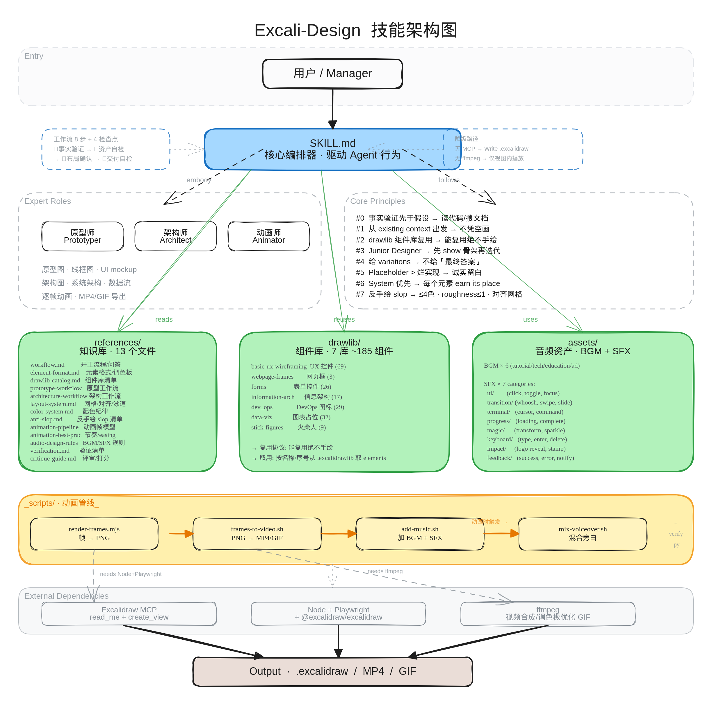

# Excali-Design

> *"一句话,一张能讲清楚的图——还能动起来。"*

用 **Excalidraw** 做高保真**产品原型图 / 软件架构图 / 信息流程图**的 agent-agnostic skill,并能通过「**绘图刷新**」把图做成逐帧 draw-on 动画(可导出 MP4/GIF)。

> 🙏 **本 skill 重度参考 [`huashu-design`](../huashu-design)(花叔 Design)设计。**
> 整套架构——SKILL.md 主干 + references 路由 + scripts 工具链 + assets 资产、以及「反 AI slop / Junior Designer / 资产优先 / 事实验证」四大哲学、动画导出流水线、音频资产——都直接继承自 huashu-design,只是把媒介从 HTML 换成了 Excalidraw 元素,并新增「绘图刷新」逐帧动画机制。没有 huashu-design 就没有这个 skill,在此致谢。

<p align="center">
  
</p>

<p align="center"><sub>▲ 这张架构图由 <b>Excali-Design 技能 + Qwen3.7-Max + OpenCode</b> 制作(<a href="excali-design%20架构图.excalidraw">源文件</a> · <a href="assets/readme/architecture.svg">SVG</a>)——语义配色、单向数据流、复用 drawlib,严格遵守它自己的反 slop 规则。</sub></p>

## 如何使用

**安装 = 对着你的 AI agent 说一句话。** 这是一个 markdown-based 的 agent-agnostic skill(Claude Code / Cursor / Codex / Cowork 等都能用),没有 npm 包要装、没有配置要填——把这个目录放进 agent 能读到的地方,然后直接说:

```
安装并使用 excali-design 这个技能,帮我画一张订单服务的架构图
```

或:

```
用 excali-design,把我这个 React 项目的组件结构画成架构图,再做成一段讲解动画
读 excali-design 技能,帮我画一套登录注册流程的产品原型
```

agent 会自己读 `SKILL.md`、按 references 路由表深入对应手册、复用 `drawlib/` 组件、(MCP 可用时)用 `create_view` 渲染。**你只管说要什么图,剩下的交给技能。**

> 不确定怎么开口?直接说「**读一下 excali-design 技能,然后问我几个问题**」——它会按 Junior Designer 流程先和你对齐需求,再动手。

## 作品示例 · 绘图刷新动画

<p align="center">
  
</p>

<p align="center"><sub>▲ <b>2026 NBA 季后赛 · 东西部晋级之路</b>——一句话用本技能做出的逐帧动画。8 帧累加 reveal:16 队入场 → 各轮真实比分 → 双分区冠军会师总决赛。球队 logo 为真实素材,赛果全部 WebSearch 核实(原则 #0),配色语义化、严守反 slop。(MP4 带 BGM 版本地用 <code>render-frames → frames-to-video → add-music</code> 生成)</sub></p>

## 它能做什么

- **产品原型 / 线框图**(v1 主干):复用 `drawlib/` 里 ~185 个现成 UI 控件,快速搭 lo-fi/mid-fi 原型,支持多屏 overview 平铺或 flow 串联
- **软件架构图**:从代码库/文档抽真实结构,按 C4 抽象层级画单向数据流拓扑,语义配色
- **信息 / 流程图**:决策流、状态机、时序图、泳道图
- **绘图刷新动画**:把任意图拆成「帧序列」,反复调 Excalidraw MCP 的 `create_view` 逐帧刷新播放;可导出 MP4/GIF + 场景化 BGM/SFX

## 核心机制:绘图刷新动画

```
animation = frames: Element[][]            // 一串帧,每帧是一组完整元素
路径 A 视图内:  for f in frames: create_view(f)         // 靠 draw-on + 帧间停顿
路径 B 导出:    render-frames.mjs → PNG → frames-to-video.sh → MP4/GIF → add-music.sh
```

三种帧生成:累加式 reveal(图一块块长出来)/ 替换式(高亮、状态切换)/ 插值式 tween(导出顺滑运动)。详见 [`references/animation-pipeline.md`](references/animation-pipeline.md)。

## 导出图片(PNG / SVG)

任意 `.excalidraw` 文件可一键导出成图片(贴 README / 文档 / PPT),用 Excalidraw 官方导出内核,和 excalidraw.com 同款渲染:

```bash
# 同时出 PNG(@2x 高清)+ SVG(矢量,可缩放/可编辑)
node scripts/excalidraw-to-image.mjs "架构图.excalidraw" --png --svg --scale 2

# 只要透明背景 PNG
node scripts/excalidraw-to-image.mjs 图.excalidraw --png --transparent --scale 3
```

上面那张架构图就是这么导出的。依赖 Playwright + chromium(见「依赖」)。

## 项目结构

```
excali-design/
├── SKILL.md                      # 主干:人格 + 哲学 + 工作流 + references 路由表
├── drawlib/                      # 7 个 .excalidrawlib 组件库(~185 个现成组件)
├── references/                   # 深度手册(按任务路由)
│   ├── element-format.md         # Excalidraw 元素 schema(离线 read_me)
│   ├── drawlib-catalog.md        # 7 库清单 + 取用方法
│   ├── prototype-workflow.md     # ⭐ v1 主干:产品原型
│   ├── architecture-workflow.md  # 软件架构图
│   ├── animation-pipeline.md     # ⭐ 绘图刷新动画机制
│   ├── animation-best-practices.md  # 动画节奏/easing/叙事
│   ├── layout-system.md / color-system.md / anti-slop.md
│   ├── workflow.md / verification.md / critique-guide.md
│   └── audio-design-rules.md / sfx-library.md   # 复用自 huashu-design
├── assets/
│   ├── readme/                   # 文档引用的展示媒体(架构图 / NBA demo)
│   ├── sfx/                       # 37 个音效(复用自 huashu-design)
│   ├── bgm-*.mp3                  # 6 首场景化 BGM
│   └── templates/                # 起手元素模板(待补)
├── scripts/
│   ├── excalidraw-to-image.mjs    # 单图 → PNG/SVG(✅ 实测)
│   ├── render-frames.mjs          # 帧 JSON → PNG 序列(✅ 实测)
│   ├── frames-to-video.sh         # PNG → MP4/GIF(ffmpeg,✅ 实测)
│   ├── add-music.sh / mix-voiceover.sh   # 音频(复用自 huashu-design)
│   └── verify.py                  # 帧/图结构校验
├── demos/                         # 示例输出
└── test-prompts.json              # 6 条评测用例
```

## 依赖

- **Excalidraw MCP**(`create_view` / `read_me`)——视图内渲染与动画播放。未接入时降级为直接产 `.excalidraw` 文件
- **导出图片/动画**:Node + Playwright + chromium(`excalidraw-to-image` / `render-frames`,从 CDN import excalidraw,无需 npm 装)+ ffmpeg(`frames-to-video` / `add-music`)
  ```bash
  npm install playwright && npx playwright install chromium   # 一次性
  ```
- **动画音频**:BGM(6 首)+ SFX(37 个)随仓库一起提供,`add-music.sh` 直接可用,无需额外下载。

## 状态

**框架已搭建并打通导出链路(v0.1)**。已就位且**实测通过**:
- SKILL.md 主干、15 篇 references、drawlib 目录、音频资产(37 SFX + 6 BGM)
- 元素格式 L2 验证(在 excalidraw.com 渲染正确)
- **导出链路 B 跑通**:`render-frames.mjs`(帧 JSON → PNG,Excalidraw 官方导出)→ `frames-to-video.sh`(→ MP4/GIF)。实测 3 帧累加 reveal → 2.7s MP4,无抖动。
- **图片导出跑通**:`excalidraw-to-image.mjs`(.excalidraw → PNG/SVG)。README 那张架构图即用它导出。

待补:
- 路径 A(视图内 create_view 刷新)——等 Excalidraw MCP 服务恢复后验证(当前 MCP 端点返回 HTML 报错)
- 手绘体字体加载(render-frames 默认衬线 fallback,非 Virgil)
- `dev_ops` 库 29 个无名图标的视觉索引、`assets/templates/` 起手模板、更多 `demos/`
